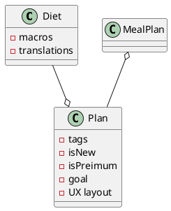

# Hello

## this is markdown

And this is the text that goes here.

```go
func string doAwesome(input []int) (Error, String){

}
```


```puml
@startuml

class Diet {
    - macros
    - translations
}

class Plan {
    - tags
    - isNew
    - isPreimum
    - goal
    - UX layout
}

class MealPlan


Diet --o Plan

MealPlan o-- Plan

@enduml
```